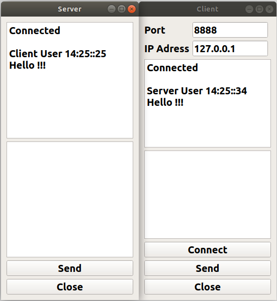

# Basic-Chat
## Info:
- Message sender Qt app
- TCP/UDP communication                                
- 2 GUI Client , Server
- qmake build tool

 
### Files:
- main.cpp
- client/clientwidget.cpp
- client/clientwidget.h
- client/clientwidget.ui
- server/serverwidget.cpp
- server/serverwidget.h
- server/serverwidget.ui

   
